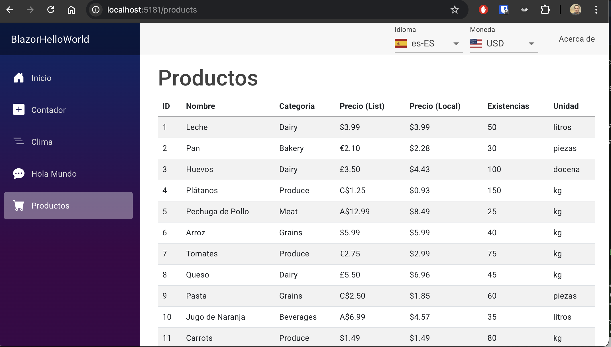

# Blazor WebAssembly Cursor AI Composer Demo



### Currency Change Animation Demo
Watch how prices smoothly animate when changing currencies:

https://user-images.githubusercontent.com/YOUR_GITHUB_USER_ID/cursor-blazor/main/docs/record.mov

A modern e-commerce demonstration application built with [Blazor WebAssembly](https://learn.microsoft.com/en-us/aspnet/core/blazor/), showcasing various features and best practices in .NET development.

## Project Creation

This entire solution was architected and implemented by [Claude 3.5 Sonnet](https://www.anthropic.com/claude) LLM using the [Cursor AI](https://cursor.sh/) Composer, demonstrating the capabilities of AI-assisted software development. Every aspect of the application - from architecture decisions to code implementation - was generated through AI pair programming.

## Features

- **Multi-currency Support**: Dynamic currency conversion and formatting
- **Internationalization (i18n)**: Multi-language support with resource files
- **Product Management**: Product catalog with categories
- **Modern Architecture**: Clean separation of concerns with Client-Server architecture

## Technical Stack

- **[.NET 9 Preview](https://learn.microsoft.com/en-us/dotnet/core/whats-new/dotnet-9)**
- **[Blazor WebAssembly](https://learn.microsoft.com/en-us/aspnet/core/blazor/?view=aspnetcore-9.0#blazor-webassembly)** for the client-side application
- **[ASP.NET Core](https://learn.microsoft.com/en-us/aspnet/core/introduction-to-aspnet-core)** for the backend API
- **[Entity Framework Core](https://learn.microsoft.com/en-us/ef/core/)** for data access
- **[RESTful API](https://learn.microsoft.com/en-us/azure/architecture/best-practices/api-design)** architecture

## Third-Party Libraries & Frameworks

### UI Components & Styling
- **[MudBlazor](https://mudblazor.com/) (v8.2.0)**: Material Design component library for Blazor
- **[Bootstrap](https://getbootstrap.com/)**: Frontend CSS framework for responsive design
- **[Flag Icons](https://github.com/lipis/flag-icons) (v6.11.0)**: CSS library for country flag icons
- **[Google Fonts - Roboto](https://fonts.google.com/specimen/Roboto)**: Roboto font family for consistent typography

### Core Dependencies
- **[Microsoft.AspNetCore.Components.WebAssembly](https://learn.microsoft.com/en-us/aspnet/core/blazor/hosting-models#blazor-webassembly) (v9.0.0-preview.1.24081.5)**: Core Blazor WebAssembly framework
- **[Microsoft.Extensions.Localization](https://learn.microsoft.com/en-us/aspnet/core/fundamentals/localization) (v9.0.1)**: Localization support for multi-language features
- **[Microsoft.AspNetCore.OpenApi](https://learn.microsoft.com/en-us/aspnet/core/tutorials/web-api-help-pages-using-swagger) (v9.0.0)**: OpenAPI (Swagger) support for API documentation

## Project Structure

- **Client**: Blazor WebAssembly frontend application
- **Server**: ASP.NET Core backend API
- **Shared**: Common models and interfaces shared between Client and Server

## Key Components

- `CurrencyService`: Handles currency conversion and formatting
- `CategoryService`: Manages product categories
- `ProductsController`: API endpoints for product management
- `CultureSelector`: UI component for language selection
- `CurrencySelector`: UI component for currency selection

## Getting Started

1. Ensure you have the .NET 9 Preview SDK installed
2. Clone the repository
3. Navigate to the project directory
4. Run both the Server and Client projects:

   In terminal 1 (Server):
   ```bash
   dotnet run --project Server
   ```

   In terminal 2 (Client):
   ```bash
   dotnet run --project Client
   ```
5. Open your browser and navigate to the Client URL (typically https://localhost:5001)

## Architecture

The application follows a clean architecture pattern with:
- Separation of concerns between Client and Server
- Shared models for consistency
- RESTful API communication
- Dependency injection for services
- Responsive and modern UI

## Features in Detail

### Currency Management
- Real-time currency conversion
- Formatted price display
- Support for multiple currency symbols
- Cached exchange rates

### Internationalization
- Multiple language support
- Culture-aware formatting
- Resource-based translations

### Enhanced Default Pages

#### Weather Forecast Page
- Added localization support for weather condition summaries
- Weather descriptions available in multiple languages (English, Spanish, French)
- Culture-aware date formatting
- Enhanced temperature display:
  - Negative temperatures highlighted in red
  - Right-aligned temperature columns with units (°C and °F)
  - Optimized column layout with visual spacing
  - Temperature units displayed next to values

#### Counter Page
- Added localization for button text and counter display
- Implemented culture-aware number formatting

## Testing Implementation

The solution implements comprehensive testing using xUnit as the testing framework across both Server and Shared projects. Tests follow a systematic approach to ensure code quality and reliability.

### Test Organization

Tests are organized by project and responsibility:

#### Shared.Tests
- `ProductTests.cs`: Core Product model validation
- `LocalizedProductTests.cs`: Product localization features
- `CurrencyInfoTests.cs`: Currency handling and conversion
- `ProductTranslationsTests.cs`: Translation collection management
- `CategoryTranslationsTests.cs`: Category translation management

#### Server.Tests
- `CurrencyControllerTests.cs`: Currency API endpoints
- `ProductsControllerTests.cs`: Product management endpoints
- `CategoriesControllerTests.cs`: Category management endpoints

### Testing Approach

1. **Model & API Testing**
   - Property validation and object behavior
   - HTTP response validation
   - Status code verification
   - Response content validation
   - Error handling scenarios

2. **Service Integration**
   - Mock-based testing using Moq
   - Service dependency injection
   - Exception handling
   - Async operations

3. **Data Validation**
   - Null and empty values
   - Special characters
   - Edge cases
   - Numeric precision
   - Currency handling

### Key Testing Patterns

1. **Arrange-Act-Assert Pattern**
   ```csharp
   // Arrange
   var product = new Product(...);
   
   // Act
   var result = product.GetLocalizedName("en");
   
   // Assert
   Assert.Equal(expectedName, result);
   ```

2. **Theory-based Testing**
   ```csharp
   [Theory]
   [InlineData("USD", "EUR", 100.00, 85.00)]
   [InlineData("USD", "GBP", 100.00, 73.50)]
   public async Task GetPriceInCurrency_ShouldHandleMultipleCurrencies(...)
   ```

3. **Controller Testing**
   ```csharp
   // Arrange
   _mockService.Setup(s => s.Method())
       .ThrowsAsync(new Exception("Service error"));

   // Act & Assert
   var result = await _controller.Method();
   var statusResult = Assert.IsType<ObjectResult>(result.Result);
   Assert.Equal(500, statusResult.StatusCode);
   ```

### Running Tests

Tests can be run per project or for the entire solution:

```bash
# Run all tests
dotnet test

# Run specific project tests
dotnet test Shared.Tests/Shared.Tests.csproj
dotnet test Server.Tests/Server.Tests.csproj
```

Or use Visual Studio's Test Explorer for a graphical interface.

### Test Maintenance

- Tests are designed to be maintainable and readable
- Each test has a clear purpose and description
- Mock services are reusable across test cases
- Common setup is handled in constructor or fixture classes
- Focus on testing business logic and API contracts

## Contributing

Feel free to submit issues and enhancement requests.

## License

This project is licensed under the MIT License - see the LICENSE file for details. 
